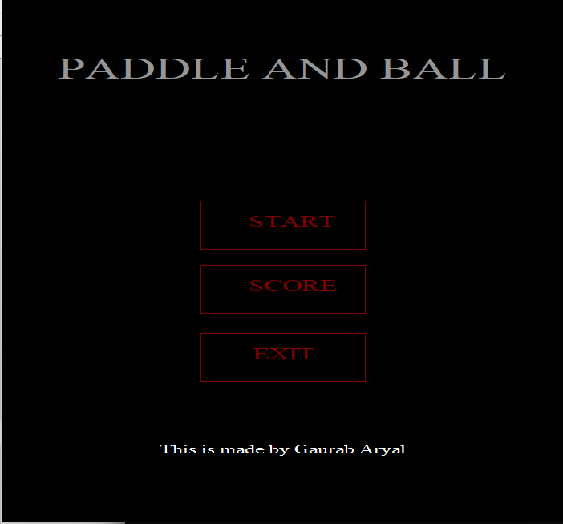
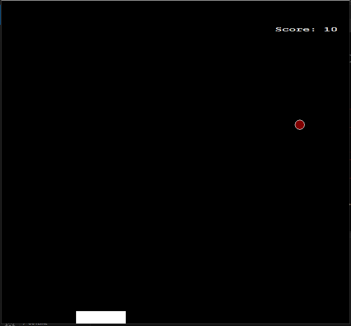
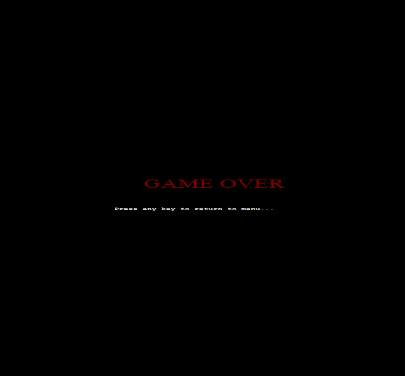

# 🎮 Paddle Ball Game

A simple but fun **Paddle Ball** game built in **C++ (WinBGI graphics.h)**.  
This project demonstrates fundamental concepts in **2D game development**, including rendering, input handling, collision detection, scoring, and saving/loading user progress.

---

## 📸 Screenshots

| Main Menu | Gameplay | Game Over |
|-----------|----------|-----------|
|  |  |  |

---

## 🚀 Features

- 🏓 **Classic Paddle Ball Gameplay**  
  Control the paddle and keep the ball bouncing as long as you can.

- 🎯 **Scoring System**  
  Gain points every time you hit the ball with your paddle. Your score is displayed live during gameplay.

- 💾 **User Profiles**  
  Enter your username before starting. The game saves your score in a local file so you can track progress.

- 🖼️ **Graphics**  
  Implemented using `<graphics.h>` with custom images for menu, gameplay, and game-over screen.

- 📂 **File Persistence**  
  Scores and player data are stored in `score.dat`.

---

## 🛠️ How It Works

### 1. **Menu**
- On launch, the main menu is displayed.
- Players can **start a new game**, **view instructions**, or **exit**.

### 2. **Gameplay**
- The paddle moves **left (←)** and **right (→)** with keyboard input.
- The ball bounces off the paddle and walls.
- If the ball touches the bottom of the screen → **Game Over**.
- Collision detection increases the score by `+10` per paddle hit.

### 3. **Game Over**
- Final score is displayed.
- Player can **return to the main menu** or **exit**.

---

## 📂 Project Structure

paddle-ball-main/
│── game/
│ ├── pic/ # Images (menu, gameplay, game over)
│ ├── game.cpp # Core game loop
│ ├── global.cpp # Global variables
│ ├── user.cpp # User input & profile handling
│ ├── game.h # Header definitions
│ ├── Makefile.win # Build script (MinGW/WinBGI)
│ └── ...
│── README.md # Project documentation

yaml
Copy code

---

## 🖥️ Requirements

- Windows system with **WinBGI / graphics.h** installed  
- MinGW or any C++ compiler that supports `<graphics.h>`  
- At least **4GB RAM** (lightweight game, runs on low specs)

---

## ▶️ Running the Game

### 1. Compile
If using **MinGW**:
```bash
g++ game.cpp global.cpp user.cpp -o paddle-ball -lbgi -lgdi32 -lcomdlg32 -luuid -loleaut32 -lole32
Or build with the provided Makefile:

bash
Copy code
mingw32-make -f Makefile.win
2. Run
bash
Copy code
./paddle-ball.exe
🎓 Learning Outcomes
This project demonstrates:

Game loop design in C++

Handling keyboard input

Collision detection

File I/O for saving progress

Basic use of graphics.h for drawing shapes and text

Structuring a small game project with multiple .cpp and .h files

📌 Future Improvements
Add sound effects (hit, score, game over).

Multiple difficulty levels (ball speed increase).

High score leaderboard.

Power-ups (multi-ball, paddle size changes).

✨ Credits
Developed by Gaurab Aryal as a learning project in C++ game development.
Special thanks to WinBGI for graphics support.

